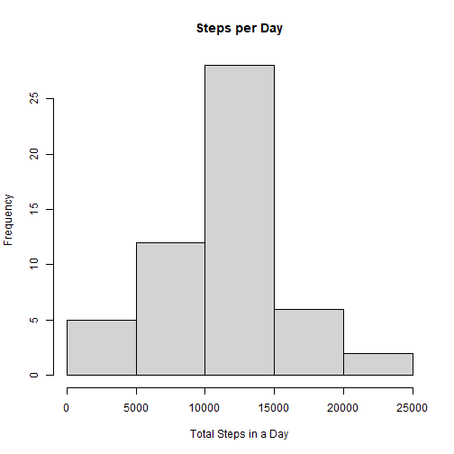
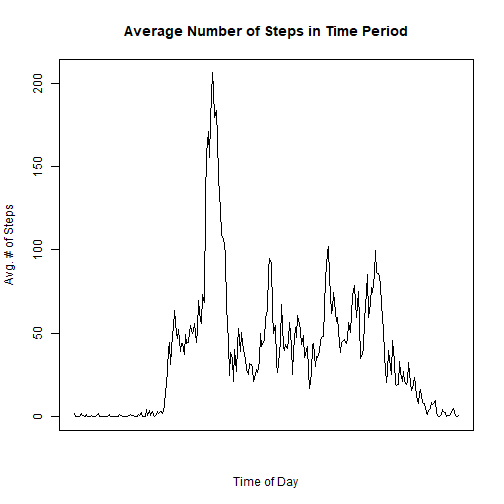
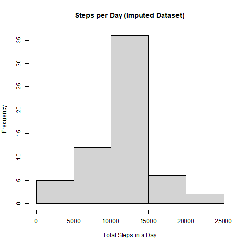
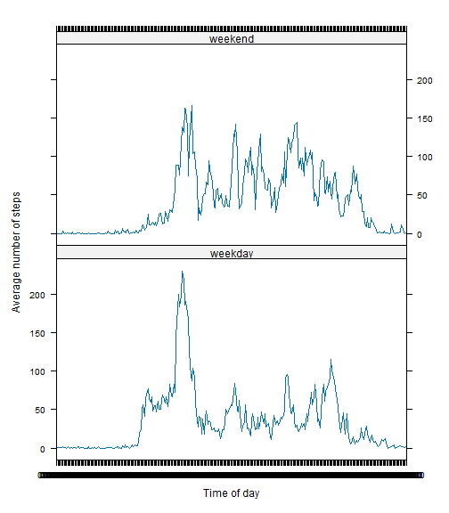

```r
library(dplyr)
library(lattice)
```

## Loading and preprocessing the data
  
  

```r
data <- read.csv(unz(description = "activity.zip", filename = "activity.csv"), header = TRUE)

# Make interval into a proper 4 digit time (HHMM)
data$interval <- paste0(mapply(function(x,y) paste0(rep(x,y), 
                                                    collapse=""
                                                    ), 
                               0, 
                               4 - nchar(data$interval)
                               ), 
                        data$interval)

# Make datetime object
data$datetime <- as.POSIXct(paste(data$date, data$interval, sep=" "), 
                            format = "%Y-%m-%d %H%M")

# Convert date column into proper data type
data$date <- as.POSIXct(data$date, format = "%Y-%m-%d")

# Convert interval into proper data type
data$interval <- strptime(data$interval, format = "%H%M")
```
  
  
## What is mean total number of steps taken per day?
  
  

```r
steps_day <- data[!is.na(data$steps),] %>% 
  group_by(date) %>% 
  summarize(totalSteps = sum(steps))

hist(steps_day$totalSteps, 
     main = "Steps per Day", 
     xlab = "Total Steps in a Day")
```



```r
meanSteps <- as.character(round(mean(steps_day$totalSteps), 2))
medianSteps <- as.character(round(median(steps_day$totalSteps), 2))
```
  
  
**Mean** Total Steps per Day = **10766.19**  
**Median** Total Steps per Day = **10765**  

  
## What is the average daily activity pattern?


```r
avgSteps_day <- data[!is.na(data$steps),] %>% 
  group_by(interval) %>% 
  summarize(avgSteps = mean(steps))

plot(x = avgSteps_day$interval, 
     y = avgSteps_day$avgSteps,
     type = "l", main = "Average Number of Steps in Time Period",
     xaxt = "n", xlab = "Time of Day", ylab = "Avg. # of Steps"
     )
```



```r
maxTime <- format(avgSteps_day[avgSteps_day$avgSteps == max(avgSteps_day$avgSteps),]$interval, format = "%H:%M:%S")
avgSteps_day$interval <- format(avgSteps_day$interval, 
                                format="%H:%M:%S")
avgSteps_day <- as.data.frame(avgSteps_day)
```

The 5-minute interval with the highest number of steps averaged across all days is **08:35:00**  


## Imputing missing values

We will use the average values per interval (averaged over each day) to fill in the missing step values.  


```r
missingRows <- sum(is.na(data$steps))

# We will impute with the interval average
imputed_data <- data
imputed_data$interval <- format(imputed_data$interval, 
                                format = "%H:%M:%S")
for (intrvl in avgSteps_day$interval) {
  imputed_data[(is.na(imputed_data$steps)) & (imputed_data$interval == intrvl),]$steps = avgSteps_day[avgSteps_day$interval == intrvl,]$avgSteps
}

imputed_steps_day <- imputed_data %>% 
  group_by(date) %>% 
  summarize(totalSteps = sum(steps))

hist(imputed_steps_day$totalSteps, 
     main = "Steps per Day (Imputed Dataset)", 
     xlab = "Total Steps in a Day")
```



```r
imputedMeanSteps <- as.character(round(mean(imputed_steps_day$totalSteps), 2))
imputedMedianSteps <- as.character(round(median(imputed_steps_day$totalSteps), 2))
```

***After Imputation:***  

**Mean** Total Steps per Day = **10766.19**  
**Median** Total Steps per Day = **10766.19**  

The imputation has changed the data but only slightly. With rounding, the mean is unchanged. The median is slightly larger now but not noticeably so.  


## Are there differences in activity patterns between weekdays and weekends?


```r
imputed_data$day <- weekdays(imputed_data$date)
imputed_data[(imputed_data$day == "Saturday") | (imputed_data$day == "Sunday"),]$day <- "weekend"
imputed_data[imputed_data$day != "weekend",]$day <- "weekday"

avgSteps_weekday <- as.data.frame(imputed_data[imputed_data$day=="weekday",] %>% 
  group_by(interval) %>% 
  summarize(avgSteps = mean(steps)))
avgSteps_weekday$day <- "weekday"

avgSteps_weekend <- as.data.frame(imputed_data[imputed_data$day=="weekend",] %>% 
  group_by(interval) %>% 
  summarize(avgSteps = mean(steps)))
avgSteps_weekend$day <- "weekend"

plotData <- rbind(avgSteps_weekday, avgSteps_weekend)

xyplot(avgSteps ~ factor(interval) | day,
       data = plotData, type = "l",
       ylab = "Average number of steps",
       xlab = "Time of day"
       )
```



